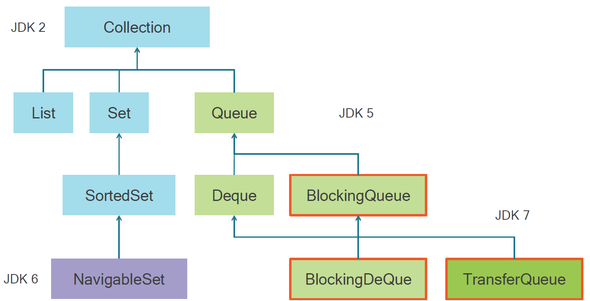
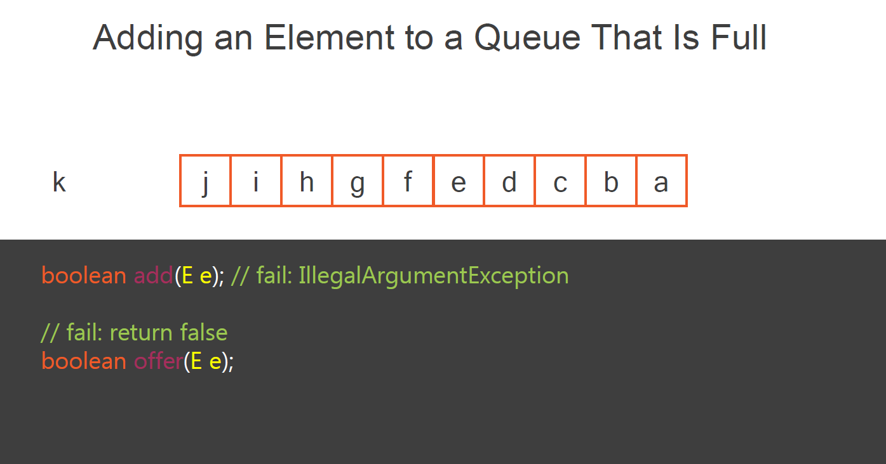
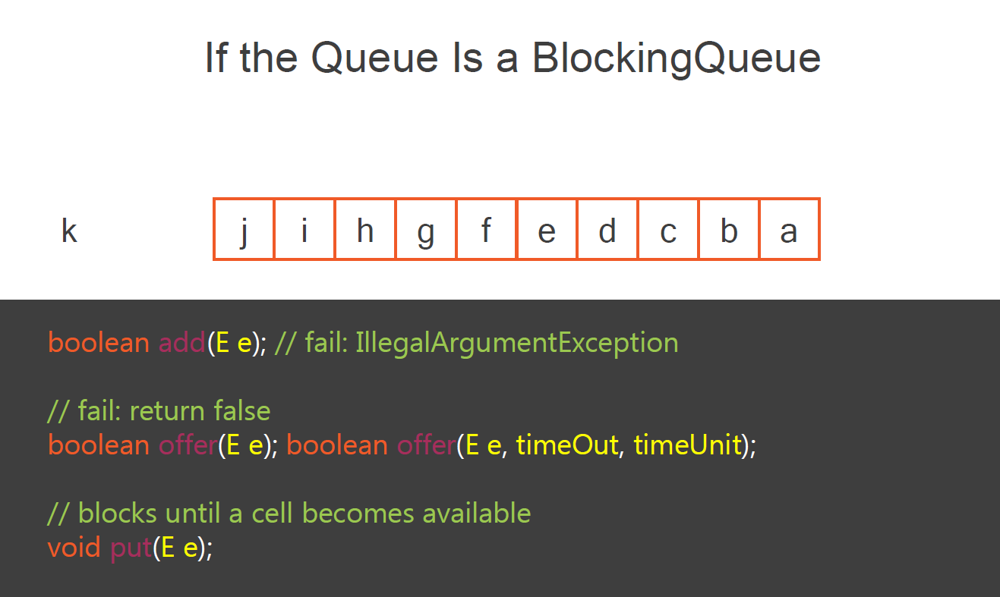

本模块主要内容是利用并发collections来简化应用设计。们将讨论collections框架的并发部分，即并发 collections 和 maps。如你所知，在collections框架中有两种结构，首先是collections本身，然后是maps。在collections部分，我们有两种并发结构，即Queue和BlockingQueue，而在maps部分，我们有ConcurrentMap，所以我们将在这个模块中涵盖所有这些。当然，我们还将介绍各种实现，并描述应该在什么时候使用哪种实现，特别是根据你的应用程序的并发级别。

#### 在API层面上实现并发性
让我们先谈谈并发接口的概念，以及为什么它们主要在Java 5中被添加到collections框架中。前几个模块中看到，我们可以使用同步的代码块或者使用锁接口来实现应用程序级别上实现生产者/消费者模式。这些并发接口的想法是提供工具来在API层面上实现，也就是让API本身具有线程安全。为此，我们需要对采集框架的接口进行新的定义，并对这些接口进行新的实现。我们在Collection Framework中有两个分支，即Collection分支和Map分支，我们会详细探讨。

#### collections和maps的层次结构，并发接口
1998年，Java 2发布了collections框架，有4个collections接口，分别是Collection本身、List、Set和SortedSet。在Java 5中，又增加了4个接口，Queue和Deque，代表双端队列，还有两个并发结构，BlockingQueue和BlockingDeque。在Java 6中，增加了非并发的NavigableSet。而在Java 7中，collections框架中加入了TransferQueue，它是BlockingQueue的扩展，它确实是一个并发结构。至于maps，第一个版本的Collection Framework发布时有maps和SortedMaps，不是并发的。在Java 5中，已经加入了ConcurrentMap。而在Java 6中，NavigableMap，不是并发的，而ConcurrentNavigableMap，显然是并发的。

并发接口是什么意思？一个接口本身并不是一个实现，所以它不可能在本质上是线程安全的。事实上，一个接口的并发性意味着它为并发环境定义了一个契约。在其方法的规范中，它告诉人们，调用这个方法应该是线程安全的。当然，JDK也提供了遵循这些契约的实现。而如果我们想自己实现这些并发接口，我们也必须遵循这些契约。但是，并发性是很复杂的。处理10个线程和处理成千上万的线程是不一样的。因此，我们还需要不同的实现，其中一些适应于低级别的并发，另一些则适应于非常高级别的并发。

### Concurrent Collections

#### 为什么你应该避免使用向量和堆栈
检查一下集合框架的并发列表。你会看到我们有两个类，即Vector和Stack，它们是众所周知的类，并且以线程安全而闻名。事实上，这些类是JDK早期的遗留结构。它们在集合框架本身之前就存在了。事实证明，它们确实是线程安全的，但非常糟糕，或者至少是非常基本的实现。如果你查看这些类的源代码，你会发现事实上所有的方法都是同步的，所以当一个线程正在读取一个向量时，允许基本的并发水平，其他线程不能访问它，无论是读操作还是写操作。所以这些结构不应该再被使用。如果你正在构建一个新的应用程序，不要使用它们，如果你正在处理现有的应用程序中的向量和堆栈，你可以考虑删除它们，用我们现在要看到的新结构来代替它们。

#### Copy On Write Arrays
我们要研究的第一个结构是写时复制结构。这种写时复制结构有两种形式，一种用于列表，另一种用于集合。让我们看看这些结构是如何工作的。好的一点是，它不依赖于任何锁定的读取操作。因此，你可以用任何数量的线程自由地、并行地读取写结构上的副本。写操作实际上是在内部创建了一个现有结构的副本，新的结构取代了以前的结构，只需以同步的方式将指针从旧结构移到新结构上。让我们来详细了解一下。例如，一个写释放的拷贝是建立在一个内部数组上的，这个数组有一个叫Tab的指针。这个数组不能被修改，所以所有的读操作都可以平行地自由进行。现在如果我们想给这个数组添加一个元素，它首先会在内部创建这个数组的一个副本，并将这个元素添加到这个副本中。所有目前正在读取数组的线程都在自由地读取之前的版本，而没有看到这个新版本。当这个新版本的数组准备好后，我们只需以同步的方式将上一版本的指针移到新版本中。所以新的读取操作会看到这个新的结构，而有其他线程在之前的结构上迭代，他们不会看到这个修改。

#### CopyOnWriteArrayList)
因此，对于写时复制结构，已经在读这个写时复制对象的线程将继续这样做而不会看到修改。而新的线程，当然会看到修改。我们有两个结构来实现这个概念。第一个是CopyOnWriteArrayList。它是list的一个实现，具有list的语义；CopyOnWriteArraySet是set的一个实现，因此具有set的语义。这些写时复制结构显然在你有许多读和非常非常少的写的时候工作得非常好，对数组的修改非常少。如果你有很多写，这意味着你将有很多数组的副本，这是很昂贵的。有一些用例非常适用于这种结构。例如，如果你想在你的应用程序的初始化阶段为你的应用程序存储参数，那么你可以以一种线程安全的方式这样做，当你的应用程序被初始化后，你不会再碰这些参数，所以你可以以一种线程安全的方式将这个Copy on Write数组分布在你想要的地方。

!!! Notes
    The thread that *already* has a reference on the previous array will *not see* the modification
    The *new* threads will *see* the modification

#### Queue and Deque
现在让我们看看第二种可用的结构类型，即队列和堆栈。当我说堆栈时，我不是指 Stack 类，而是指堆栈的概念。我们有两个接口来处理这个问题，叫做 queue 和 deque。Deque是双头队列的意思，它可以被看作是一个可以从头部和尾部访问的队列。我们有一个叫ArrayBlockingQueue的第一个实现，我们将看到。它是一个建立在数组上的有界阻塞队列。有界的意思是，我们用一定数量的单元格创建一个阻塞队列，即一定大小的数组，一旦这个队列满了，它就不会自我扩展。向它添加元素就不可能了。而我们有ConcurrentLinkedQueue。它是一个无界的阻塞队列，我们可以在其中添加我们需要的元素。队列是如何工作的？我们都知道，在计算机科学中我们有两种队列，一种是FIFO，先入先出，也就是队列本身，另一种是LIFO，后入先出，也就是栈。在JDK中，它们的模型如下，queue是队列的接口，Deque是队列和栈的接口。事实上，我们在 JDK 中没有一个纯粹的堆栈，也就是一个模拟堆栈而不模拟队列的接口。我们不计算堆栈类，因为同样地，你不应该使用这个类。

#### 队列如何在并发环境中工作
假设我们的队列是建立在一个数组上。生产者将从尾部添加元素，消费者将从头部消费它们。所以我们的队列中有几个元素。这些元素将被消费者一个接一个地消费掉。但我们是在一个并发的世界里。我们可以有尽可能多的生产者和尽可能多的消费者，当然，他们每个人都在自己的线程中，所以我们的队列或deque将以并发的方式被访问。当然，一个线程不会事先知道队列或堆栈中有多少个元素，查询一个并发结构中的元素数量并不是一个好主意，因为在我们查询和使用这些信息的时间之间，这些信息可能已经发生了巨大的变化。因此，这引起了两个问题。
首先，如果队列或堆栈满了，我们需要向其中添加一个元素，会发生什么情况？如果你还记得我们使用锁接口实现了什么，你可能记得我们在线程上调用了wait或await方法。

假设我们想给一个已满的队列添加一个元素。这可能发生在ArrayBlockingQueue上。当然，这不会发生在ConcurrentLinkedList队列中，因为这个ConcurrentLinkedList队列可以根据它要容纳的元素数量来调整其内部大小。第一种行为是我们应该以IllegalArgumentException失败，这就是add方法的行为。事实上，如果我们试图用这个方法添加一个元素，它就会以异常的方式失败，但是还有其他的方法来处理这个问题。我们还可以调用offer方法，这是另一个方法，这个方法将返回false而不是抛出这个IllegalArgumentException。另一种方法是告诉调用线程，添加一个元素是不可能的，如果队列是一个BlockingQueue，这就是BlockingQueue的阻塞部分的语义，我们也可以尝试在这个队列中放入一个元素，这个调用将阻塞，直到有一个单元变得可用。我们甚至有一个失败的行为，这是一个有超时的报价调用。在这里，我们说好吧，我想在队列中添加这个元素，我可以等待，比如说100毫秒来这样做。如果过了这个时间，这个元素还没有被添加，那么我宁愿失败，并通过返回一个假值来完成。所以我们可以看到，向队列中添加一个元素可以有三种方式加一种。它可以用一个异常来失败，用一个特殊的值来失败，这里是布尔值，或者阻塞，直到有一个单元变得可用。所以这就是事情的基本工作方式，我们将对队列和deque的所有操作进行同样的处理。

!!! Notes
 - Two behaviors:
      - Failing with an *exception*
      - Failing and *returning false*
 -  And for blocking queue:
    - *Blocking* until the queue can *accept* the element

#### 队列和Deque中的错误处理
所以简而言之，对于在队列尾部增加一个元素，我们有两种行为。我们可以用一个异常来失败，我们可以通过返回false来失败，如果队列是一个阻塞队列，我们可以阻塞直到队列可以接受这个元素。但是我们也有Deque和BlockingDeque。Deque可以通过addFirst和offerFirst方法在队列的头部接受元素。在BlockingDeque的情况下，putFirst、add offer和put行为与我们刚才看到的行为是一样的，即以异常的方式失败，以返回false的方式失败，以及阻塞直到有一个单元可用。但我们还没有完全完成。我们还有get和peek操作。get是指从队列中删除一个元素，peek是指检查一个元素而不把它从队列中删除。所以对于队列中的poll和peek返回null。删除元素将抛出异常。对于BlockingQueue，*take*将阻塞，直到有一个元素可用。对于deque，pollLast和peekLast返回null，removeLast和getLast返回异常，在BlockingDeque的情况下，*takeLast*将阻塞直到有一个元素可用。

!!! Notes
   - Queue:
      - Returns null: `poll()` and `peek()`, `pollLast()`and `peekLast()`
      - Exception: `remove()` and `element()`, `removeLast()`and `getLast()`
  - BlockingQueue:
      - blocks: `take()` `takeLast()`

所以对于Queue和BlockingQueue，我们有四种不同类型的队列，它们可能是阻塞的，也可能不是，它们可能提供来自两边的访问，也可能不是，所以这就构成了四种队列类型。我们有不同类型的失败，用一个特殊的值失败，这里是一个布尔值，用一个异常失败，或者阻塞，直到操作可以进行。所以所有这些使API变得相当复杂。我们在其中有很多方法。JDK在这一点上组织得很好。如果你查看Queue、BlockingQueue、Deque和BlockingDeque的JavaDoc，你会看到所有这些方法的表格，其中有一个很好的总结。

### Concurrent Maps

#### 并发图及其实现的介绍
现在让我们来看看并发maps的概念。事实上，我们只有一个接口，即ConcurrentMap，它是maps接口的一个扩展。这个ConcurrentMap的目的不是为maps接口添加任何新方法，而只是重新定义这些方法的JavaDoc。我们有两个ConcurrentMap的实现。第一个是ConcurrentHashMap。到JDK 7为止有一个，在JDK 8中，它已经被我们完全返回。我们将看到这一点。还有Java 6中引入的ConcurrentSkipListMap，它不依赖于任何同步。

#### ConcurrentMap 原子操作 的接口
除了是线程安全的，ConcurrentMap还定义了原子操作。它们是为它们准备的。第一个是putIfAbsent，它接收一个键和一个值，如果这个键还没有出现在maps中，它将把这个键值对添加到maps中。这个putIfAbsent是原子性的，即在检查maps中是否存在键和添加键值对的瞬间，没有其他线程可以中断这个方法。remove的版本也是如此，它需要一个键和一个值。如果这个键值对存在，它将被从maps中删除。事实上，它等同于删除（如果存在）。在线程检查maps中是否存在与正确值相关的键的瞬间和执行移除的实例之间不可能出现中断。然后我们有两个最后的方法，第一个是替换，它需要一个键和值，它将用这个新的值替换当前与该键相关的值，以及替换键、现有值和新值，如果现有值已经与这个maps中的键相关，它将用新值替换现有值。这两个替换方法在检查maps中的键是否存在和替换值之间不能被打断。
并发图及其实现的介绍

#### HashMap的并发性
现在让我们仔细看看这些实现，让我们试着理解这个实现的关键是什么。我们需要的实现是线程安全的，在一定数量的线程内是高效的，我们将看到这是处理maps的一个关键点，还有一些高效的、并行的特殊操作，而这是由Java 8的ConcurrentHashMap提供的。哈希图内部是如何工作的？要了解这一点对理解并发性也很重要。在JDK中，hashmap是建立在一个数组上的。当我想把键值对添加到这个数组中时，首先我从键值中计算出一个哈希码。这个哈希码将决定这个数组的哪一个单元格将保存键值对，当这一切完成后，一个指针将从这个单元格指向这个值对。因此，如果我的hashmap中有两个键值对，这个结构将是如下。注意，每个单元格被称为一个桶，一个桶可以容纳几个键值对，因为不同的键可能有相同的哈希码。因此，向maps添加键值对是一个分几步走的问题。首先，我们需要计算密钥的哈希码。其次，我们需要确定数组中的哪个单元格将容纳这个键值对，我们首先需要检查这个桶是否已经创建。如果没有，那么我们就创建它并将键值对添加到其中，非常简单。如果已经有一个桶，我们需要检查这个桶是否已经持有这个相同的密钥。如果是这样，那么我们试图添加的值将取代现有的值。如果不是这样，就会有一个特殊的过程被启动。在hashmap中，它将创建一个链接列表，直到一定数量的键值对，并将切换到一个红黑树，超过这个数字。这是完整的步骤，即maps的更新。在一个并发的世界里，所有这些步骤都不能被任何其他线程打断，因为如果是这样的话，它就会破坏maps，要么破坏桶，要么破坏链表，要么破坏红黑树。

