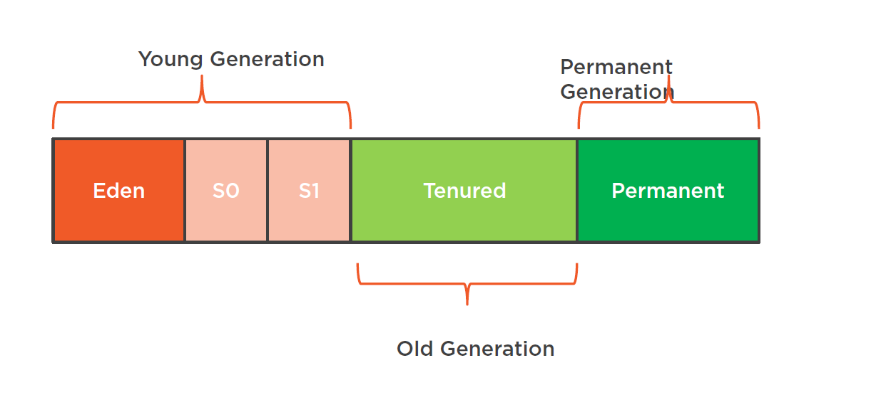
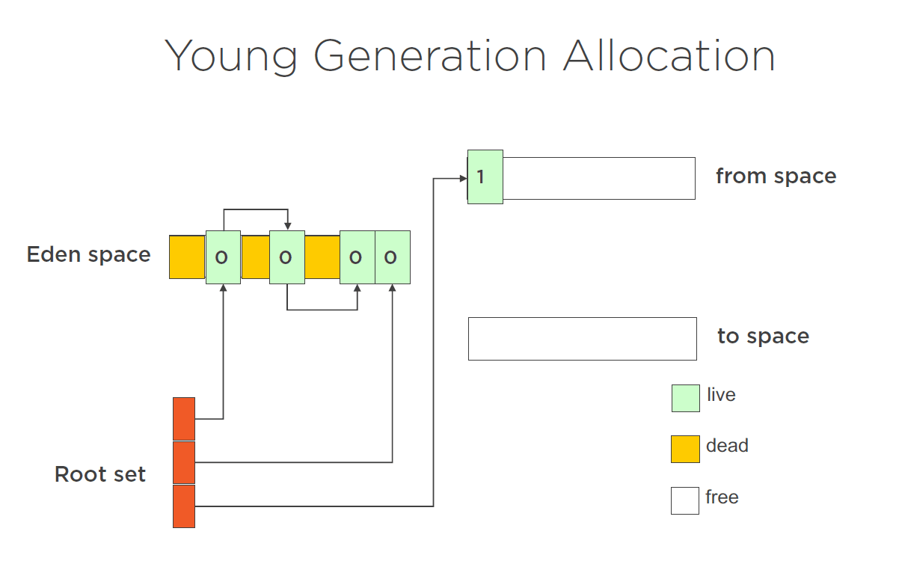
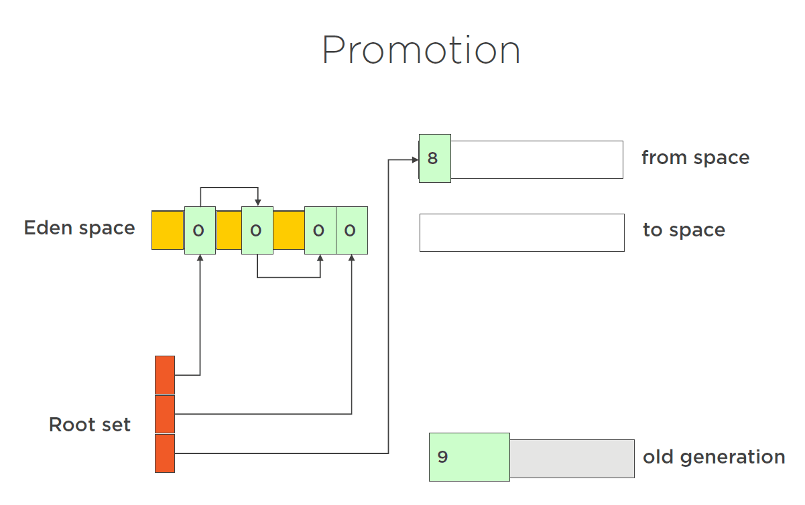
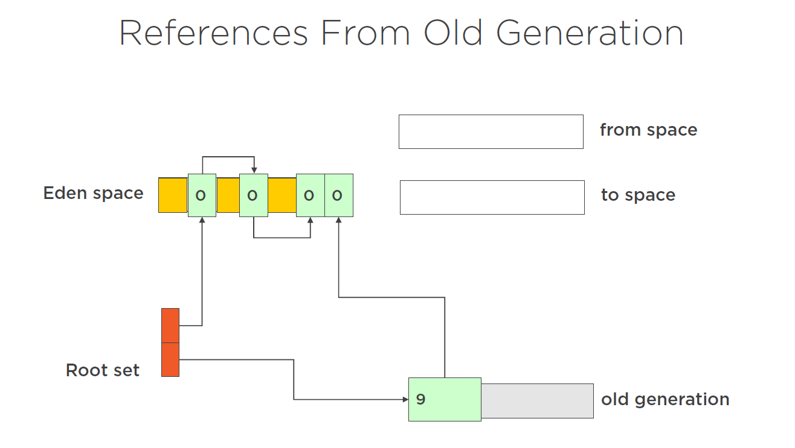
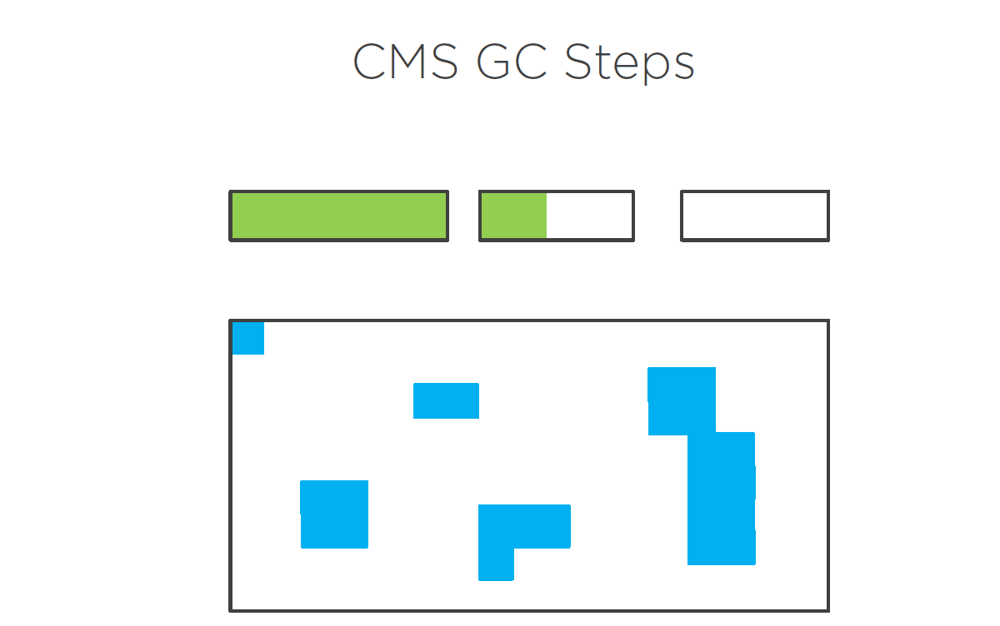

# 深入理解  Oracle JVM 的GC 
## 引言
在上一章中，我们谈到了使用垃圾收集器的一般性问题。我们现在要考虑的是垃圾收集器底层原理。这里有很多事情需要考虑。例如，对于垃圾收集器，我们有所谓的*stop the world event*。*stop the world event*是指垃圾收集器暂停整个应用程序的时候。在这一时刻，它开始GC。我们要尝试尽量减少这些事件。我们也可能需要考虑内存碎片的问题。那么，当垃圾收集器运行时，它是一次性地对内存进行碎片整理，还是把它留到以后的阶段，或者它只是让内存碎片化，因为让**内存碎片化**的成本比试图进行碎片整理要低？我们还必须考虑到垃圾收集器的吞吐量。它能多快地运行，多快地收集垃圾，这是否会影响你的应用程序的行为？为了实现这些事情，虚拟机里面有不同的垃圾收集器。有一种混合的生成性垃圾收集器，它们做**复制**，做**标记**和**扫除**。有些会留下内存碎片，有些不会。你必须选择你想使用的这其中的哪一个。在这一章中，我们将看看虚拟机的这些不同类型的垃圾收集器，以及它们如何在虚拟机中使用。还有一件事要考虑的是，如果你是在**多核**机器上运行。所以现在我们有多个进程，我们有多个线程。我们能不能有一个垃圾收集器，可以和我们的应用程序同时运行？是否与应用程序并行运行？而这是否会给应用程序带来好处？再说一遍，Java也提供了这些类型的垃圾收集器。

## Java虚拟机中的垃圾收集基础知识
因此，在我们深入探讨垃圾收集的细节之前，让我们先回顾一下Java虚拟机内部的一些基本理念。应用程序中的内存空间被分解成两个所谓的世代，一个是新生代，一个是旧生代，所有新（对象）的分配通常都进入新生代中。这些对象被分配到称为*伊甸园空间  （Eden space） *的东西中。你可以想象这句话的由来。这就是我们要分配对象进入的比较早期的空间。另外，作为新生代的一部分，有两个所谓的幸存者空间，当新生代的内存被垃圾回收时，这些空间会被使用。因此，在新生代的垃圾回收中幸存下来的对象会被移到这些幸存者空间中的一个。**在任何时候，只有一个幸存者空间在使用**。一旦发生垃圾回收，对象就会被复制到一个新的生存者空间，而原来生存者空间中的任何对象也会被复制到新的生存者空间。因此，所有在新生代垃圾收集中幸存下来的对象都生*live*在这些幸存者空间中。旧生代是较为*持久*对象的去处。现在我们还没有定义我的*持久*是什么意思，但我们稍后会讨论这个问题。但基本上，一旦一个对象经历了若干次垃圾收集，GC运行时决定这个对象现在基本上是永存的，它将把它移到旧一代。所以内存布局是这样的。

这是个图解性的东西。这并不是应用程序内部内存分层的精确表示。因此，在这里我们可以看到新生代的伊甸园空间和两个标有S0和S1的生存者空间。我们有旧生代的空间，也叫**终身空间**，老的对象住在这里，这些对象可以住很长时间。还有一个叫做永生代。在这里有Java运行时使用的东西，例如，类的信息被存储在这里。从本质上讲，这个空间是永远不会被垃圾收集的。那么，为什么我们要有这两代？我们的想法是，一旦对象经历了几次垃圾收集，也就是说，它们变成了老对象，它们就更不可能死亡。它们更有可能存*live*很长一段时间。所以我们把这些对象移到这个旧生代空间，垃圾收集器在这个空间上运行的频率较低。因此，新生代的对象往往*live*得很短；而旧生代的对象已经*live*了很长时间，而且很可能继续*live*下去，所以不太可能需要垃圾收集。你倾向于早死或永远*live*着,这就是所谓的垃圾收集的新生代理论。

## 小GC 和大 GC (Minor and Major)

因此，当垃圾收集器收集新生代的对象时，这被称为小GC。对象最初被分配到伊甸园空间。当垃圾收集器运行时，对象被复制到这个生存者空间，也包括上一次垃圾收集时使用的生存者空间的对象，即现在生存者空间被交换了。因此，在下一次垃圾收集运行时，原来的生存者空间现在是新的生存者空间。然后，下一次分配将被分配到伊甸园空间。
+ Objects allocated into Eden space
  1. When GC runs objects are copied to
  ‘newer’ survivor space
  2. Objects from ‘older’ survivor space also
  copied to ‘newer’ survivor space
  3. Survivor spaces are swapped
+ New objects allocated into Eden

当旧生代满了之后，就会发生一次大的垃圾收集。现在，主要的垃圾收集要比次要的垃圾收集慢，因为主要的垃圾收集要SCAN **heap**的一大部分。也有可能被分配的内存已经被分页了，所以这些内存必须被分页回来。所以我们希望这些主要的垃圾收集比次要的垃圾收集运行得更少。所以，当旧的一代或永久的空间满了的时候，就会触发大的垃圾收集。在Oracle Java VM上，它通常会同时收集旧生代和新生代。这其实就是所谓的完全GC。一个主要的GC会收集旧的一代，一个完整的GC会同时收集年轻和旧的一代。但这两个术语往往被交替使用。所以，在一个主要的垃圾收集中，内存被从新生代复制到旧生代。所以这被称为`promotion`。内存经历了一定数量的垃圾回收后,JVM最终会将内存 `promotion` 到旧生代。如果生存者空间已满，也会发生这种情况。如果生存者空间满了，那些从伊甸园空间的垃圾收集中幸存下来的对象就没有地方可以进入生存者空间了。所以我们会开始从幸存者空间晋升到旧生代的空间。我们也可以配置，总是在旧生代里面创建对象。

想象一下，我们在伊甸园空间里有一些对象还没有经过垃圾回收。我们有一个在旧生代的大型对象，收集次数为9，它经历了9次垃圾收集。而我们在幸存者空间中有一个对象，已经经历了8次垃圾收集。当我们运行GC时，我们会注意到Eden空间的对象被复制到to空间，而原来在survivor空间的对象现在已经经历了多次垃圾收集，所以被提升为旧生代的一部分。除了对象在经历了多次垃圾回收后被转移到旧世代外，也可以直接将对象分配到旧空间。现在没有直接这样做的方法。没有任何JVM选项可以说总是在旧空间分配对象。但你可以做的是在虚拟机上设置这个叫做` -XX PretenureSizeThreshold =<n>`的选项，然后大于`n`字节的对象将被直接分配到这个旧空间。

## Java虚拟机中如何执行分配
GC的一个主要工作是收集，另一个是分配。当我们在Java中分配一个对象时会发生什么？理想情况下，我们希望这个分配能尽可能快。所以最简单的方法是使用指针运算。所以这里我们有一个指针，它指向堆的开始。当我们分配一个对象时，该对象被分配到指针上，而我们的指针被简单地移动。所以它指向了堆中的下一个空闲空间。下一次分配分配了一个对象，移动了指针。下一次分配，分配对象，移动指针。而移动指针是非常、非常便宜的。这是一种非常、非常快速的分配内存的方式。所以前面的图片在单线程环境下是很好的。但是想象一下在多线程环境下会发生什么。这里你有两个指针同时竞争同一块内存。这就涉及到锁，而锁是很昂贵的。所以在Java中，我们使用了一个叫做`Thread Local Buffer`的东西，或者叫`TLAB`。每个线程都在伊甸园空间里得到自己的缓冲区。这些线程只能分配到这个缓冲区。现在不存在对内存的争夺。**每个线程都有自己的缓冲区，每个线程都可以在缓冲区内分配空间，而不与其他线程竞争**。所以不需要锁。而且，这使分配变得非常、非常快。

## 什么是卡表以及如何在垃圾收集中使用它

所以我一直在使用 "live "这个词，而且我一直在谈论*live root*。但这实际上是什么意思？什么是*live root*？*live root* 是对诸如**堆栈**这类的对象的引用。堆栈基本上代表了应用程序的实时运行，所以堆栈跨越所有线程。因此，任何从堆栈框架上的变量引用对象的参考必须是*live root*的参考。
任何静态变量以及应用程序中任何持有对对象的引用的静态变量，这些静态变量并不附属于一个特定的实例或对象。它们只是作为本质上的全局变量存在。任何被静态变量引用的对象也必须在GC中保持存活。而且它们也是一些其他的引用。例如，使用Java原生接口。 如果我们使用同步 `synchronization`锁,这些也是活的引用。因此，任何具有*live root*引用的对象在GC期间都是存活的。这些来自*live root*的引用被跟踪。所以我们有一个对象的引用是活的。如果它持有对任何其他对象的引用，这些对象也会保持活跃。

记住，垃圾收集器并不能破坏任何活跃对象。我们必须跟踪任何从根开始的引用，直到找到所有我们现在知道是任然活的对象。这里还有一件事需要考虑，特别是当我们考虑新生代的垃圾收集时。我们可能有一个从活根到现在处于旧生代的对象的引用。如果它有一个对新生代对象的引用，那么我们就需要跟踪这个引用，以确保我们不会在新生代销毁这个对象。

当我们做一个新生代垃圾回收时，我们不得把新生代的该对象从旧生代的引用中删除。所以我们需要确保该对象保持活力。
 这会引发问题。当我们做新生代的垃圾收集时，垃圾收集器只看新生代的对象的引用，我们把对象的引用放在新生代，也就是说，它忽略了旧生代的对象。而它这样做是为了提高效率。如果我们需要查看旧生代的对象，那么我们也可以在旧生代做一个垃圾回收。我们必须把所有的东西都装进内存。 而这有点违背了我们有多个世代可以进行垃圾收集的目的。为了解决这个问题，我们有一个叫做卡表的东西 （card table）。
  具体情况是这样的。当对新生代对象的引用发生写入时，这些写入会经过一个叫做写屏障（`write barrier`）的东西。写入屏障触发了Java虚拟机中的代码，这个代码更新了一个表的条目，这些表称为**卡表**。卡表中的每个条目拥有512字节的内存。所以我们的想法是，如果512字节的内存中有任何东西被改变，那么卡片表就会被更新。在一个小的GC中，卡片表被扫描，寻找任何改变的数据。这块内存被加载，该内存中的任何引用被跟踪，然后这些引用被标记为正在使用中。

!!! Notes
        card table:

        1. Each write to a reference to a young object
        2. goes through a write barrier
        3. This barrier updates a card table entry
        4. One entry per 512 bytes of memory
        5. Minor GC scans table looking for the areas
        that contain references
        6. Load that memory and follow the reference
  
   所以在这里我们有一个简化的记忆图片。我们展示的是新生代，旧生代，以及card table。为了保持简单，我们在这里没有显示任何活根。所以现在的想法是，当旧生代的一个对象为新生代的一个对象更新一个引用时，或者分配一个对象到新生代。旧生代的对象现在有一个对该对象的引用。当这种情况发生时，写到内存的分配对象会经过一个写屏障。Java虚拟机管理着这个写屏障，当它看到这个写时，它就会更新卡表中的相应条目。同样，这发生在任何写进新生代的情况下。因此，如果我们在新生代中分配另一个对象，而这个对象是来自于旧生代中的东西，那么这个写会通过一个写屏障，Java虚拟机会管理这个写屏障，并且再次更新卡片表中的相应条目。所以现在当垃圾收集器运行并收集新生代时，它从活根开始，跟随这些活根到新生代中的任何对象，跟随新生代中一个对象到另一个对象的任何引用。新生代的垃圾收集并不看对旧生代对象的引用。相反，它所做的是扫描卡片表。如果它在卡片表中发现任何有标记的区域，它就会加载相应的内存，并跟踪这些引用，将这些对象标记为活着。

## 垃圾收集器的串行与并行
之前我们说Java有不同的垃圾收集器，我们可以通过向虚拟机传递一个标志来选择使用哪个垃圾收集器。所以我们将在这里看到这些标志。我们通过`-XX`，然后`+UseSerialGC`，`+UseParallelGC`，`+UseParallelOldGC`来选择这些垃圾收集器之一。还有一种叫做并发标记和串行收集器收集器的东西，还有**G1**垃圾收集器。我们现在就来看看这些收集器是如何工作的
 因此，我们要看的第一个收集器是串行收集器。串行收集器，并行收集器和并行旧收集器。这些都是非常相似的，它们都以我们之前看到的方式工作。所以我们有伊甸园空间、生存者空间、旧空间的概念。有标记和擦除算法，然后还有一个复制算法。它们的不同之处在于每个收集器的并发量。因此，**串行收集器**是单线程的，这意味着这是一个会阻塞应用的收集器。 停止一切，运行垃圾收集器。我们可以像之前看到的那样使用标记和扫除。它就像我们之前看到的那样进行复制。而这个收集器对于运行在客户端的小程序是可以的。它不适合在服务器上运行的大规模企业应用程序。
 **并行收集器**使用多个线程进行小规模的收集，但做大GC 仍然会阻塞应用。除此以外，它使用与串行收集器相同的进程。而伊甸园空间、幸存者空间、旧空间。这是完全一样的，但可以多线程并行。这种收集器适合在服务器上使用，因为并发性有助于收集器的可扩展性，而且我们降低了阻塞。
 **并行旧收集器**与并行收集器类似，但它使用多个线程，既用于小收集，也用于大收集。因此，当我们在收集旧空间时，我们也有多个线程在那里。这些天来，我们倾向于使用这个收集器而不是并行收集器，因为有了并行旧收集器，我们在小收集和大收集时都有并发性。

 **我们也有并发的标记和扫除收集器**。 现在这个收集器只收集旧空间，因为它只在主要的垃圾收集期间运行。这个收集器与我们之前看到的收集器不同，它不再是一个碰撞指针分配的收集器。如果你还记得早些时候，我们看了一下内存是如何分配的。在大多数情况下，我们分配内存，然后简单地将指针移动到内存的下一个地方，并在那里进行下一次分配。并发标记和清扫收集器不再以这种方式工作。
 相反，**CMS收集器**所做的是对堆进行分割，并为这些分割的每个部分管理空闲列表集。它试图将对象分配到这些片段中的一个，因此必须跟踪这些空闲列表并更新空闲列表。CMS收集器的工作方式是，它有不同的阶段。其中有些阶段是阻塞的，有些是并发的。 这些阶段。有一个**初始标记阶段**，这是一个阻塞阶段。这个阶段所做的是跟踪所有的根引用并标记这些对象。所以这可能会发生得非常快。这里只是跟踪根引用。然后是一个**并发标记阶段**。并发标记阶段会遍历在原始标记阶段被标记的对象的对象图。这是以并发的方式发生的。我们不停止任何线程。我们只是与应用程序中的所有当前线程一起运行。所以，这应该会很快发生。如果在这个阶段运行时有任何分配，那么这些分配就会被自动标记为实时。因此，我们再次通过写屏障，写屏障将标记这些分配，并告诉垃圾收集器这些东西是活的。然后是一个注释阶段。**注释阶段也是一个阻塞的事件**。现在的情况是，我们寻找在并发标记阶段停止后分配的对象。所以，我们再次忽略了之前所有被标记的对象。再说一遍，这个阶段应该发生得非常快。然后是**并发扫除阶段**。正是在这个阶段，我们可以释放所有在上一阶段没有被标记的对象。，最后，我们重置。重置就是重置所有的东西，为下一次运行做好准备。所以它的工作原理是这样的。
   
 这里我们展示了一个伊甸园空间，几个幸存者空间，以及旧的空间。在伊甸园空间，我们已经分配了绿色标记的内存。而在旧空间中，我们已经分配了蓝色标记的内存。当GC运行时，那些在垃圾收集中幸存下来的对象，如果低于晋升到旧空间的阈值计数，就会像以前的垃圾收集器一样，被移到第二个幸存者空间。然后，那些通过了垃圾收集计数的对象被提升到旧空间。但现在我们不使用碰撞指针了。现在这些对象被分配到了旧空间的某个地方，这就是图中深蓝色区域所显示的。当CMS GC运行并查看旧空间时，旧空间中任何没有被标记的对象都会被移除。因此，我们最终得到了这个碎片化的空间，并且我们最终得到了由自由列表管理的碎片。

## G1 GC
所以最后，我们有了G1垃圾收集器。这个垃圾收集器是在Java 6中引入的，但直到Java 7才正式支持它。它是一个与其他垃圾收集器非常不同的野兽。这是一个被称为压缩收集器的东西。而这个计划是对并发标记和扫除收集器的替代。G1收集器是为服务器应用程序准备的。它是为那些在有大量内存的多处理器机器上运行的应用程序设计的。而这与我们所看到的其他收集器的工作方式非常不同。我们现在不是简单地有一个伊甸园区域和一个永久区域，一个年轻的内存和一个老的内存，而是把整个内存空间分解成几个区域。内存被分配到这些区域中。它仍然有伊甸园、生存者和永久空间的概念，但这个概念被G1收集器管理得非常不同。因此，G1收集器将内存分解成区域。

正如我们在这里看到的，我们仍然有绿色显示的伊甸园空间的内容，蓝色显示的生存者空间，以及橙色显示的旧空间。这些空间的使用方式与之前相同。所以新的内存被分配到伊甸园空间中。在次要的GC运行后，该内存被移入幸存者空间，而旧的对象被提升到旧空间。对于G1收集器，这被称为疏散。因此，被疏散的对象在这些区域之间移动，所以从Eden移动到survivor，Eden移动到old，survivor移动到old，最终被完全丢弃。所以在这里，例如，我们有一些内存分配到Eden空间，还有一些内存在old空间。当GC在年轻一代上运行时，那么伊甸园空间中的内存就会被收集起来，聚集到一个被指定为幸存者区域的区域。对于老的GC，有一个类似的想法。同样，我们有伊甸园空间的内存和旧空间的内存。当一个主要的收集完成后，所以它收集了旧空间的内存，这些内存被完全丢弃了。因此，在这种情况下，我们不考虑伊甸园空间，并且我们已经抛弃了未使用的旧空间区域。

!!! Notes
        + Meant for server applications
          - Running on multiprocessor machines
        with large memories
        + Breaks heap into regions
          - Still has concept of Eden, Survivor and
        Tenured spaces
        + Objects are 'evacuated'
          - Moved/Copied between regions

## 如何选用
那么，我们应该使用哪个采集器？嗯，你可以想象，这个问题没有简单的答案。我们已经看到，Java提供了不同的垃圾收集器，从串行收集器一直到新的G1收集器。从这些收集器中挑选一个并不是一个简单的工作。网络上有很多关于应用分析和根据分析结果选择正确的收集器的文章。你需要在测试应用程序时，尽可能在接近生产负载的情况下运行它，然后使用其中的数据来选择垃圾收集器。理想情况下，你会使用许多不同的垃圾收集器并使用Java运行时提供的许多标志来运行测试。最后，就是一些参考资料。有一些很好的Oracle参考资料谈到了这些垃圾收集器如何工作。
  +  https://docs.oracle.com/en/java/javase/11/gctuning/index.html
  +   http://www.oracle.com/webfolder/technetwork/tutorials/obe/java/G1GettingStarted/index.html