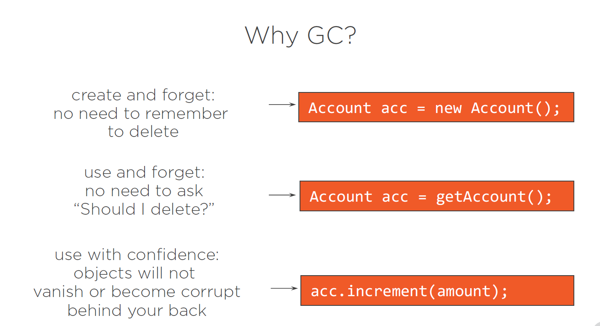
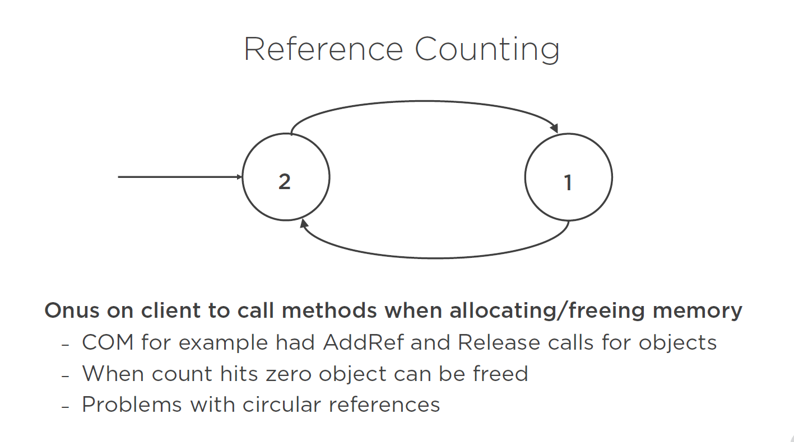
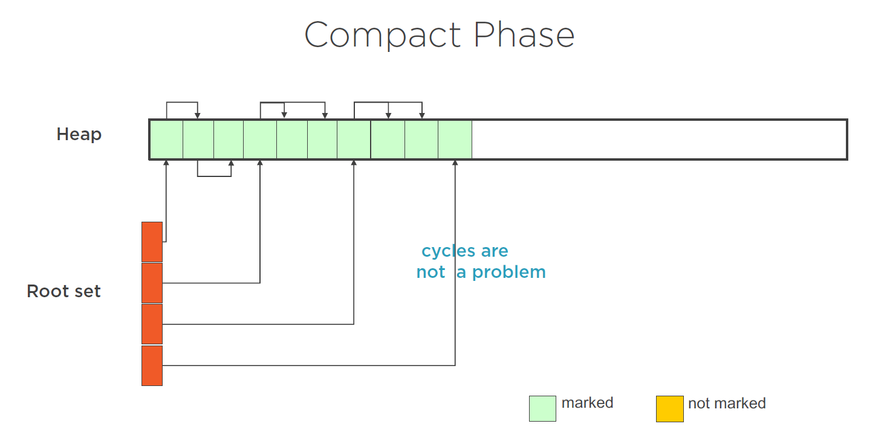
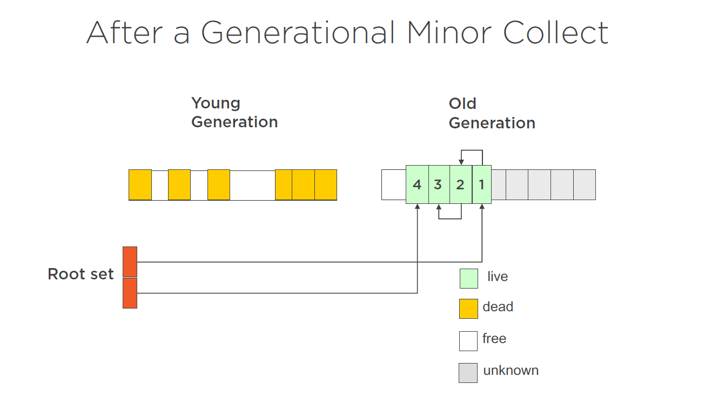

# 概述

在本文，我们将探索Java虚拟机中的垃圾收集和内存管理的各个方面，包括GC是如何工作的，我们如何与垃圾收集器进行交互，既可以从外部角度，即使用Java虚拟机为我们提供的一些工具，也可以使用虚拟机中的一些类与垃圾收集器进行内部交互。在我们这样做之前，我认为最好先了解一下我们为什么需要垃圾收集。在Java之前的语言中，比如`C`和`C++`，每当我们分配内存时，所以在这个例子中我们分配了一个对象，在某些时候，我们需要记住删除该对象并释放该内存。如果我们不这样做，我们就会出现内存泄漏。  
在Java中，情况并非如此。所以在Java中，我们可以分配一个对象，我们可以使用它，然后当这个对象不再被引用时，**垃圾收集器** 会释放该对象所使用的内存。还有一些围绕着 **谁应该删除一个对象** 的问题。所以在这里，我们调用一个叫做getAccount的方法，返回一个账户对象。实际上谁拥有这个对象？是账户对象的接收者，所以我有责任删除它吗？还是对象的给予者，即实现getAccount的那个东西。如果我们不清楚这一点，而且双方都不删除该对象，我们最终会出现内存泄漏。如果我们不清楚这一点，并且双方都删除了对象，我们就会在以后出现一些 **空指针异常**，这将是非常、非常难以追踪的。最后，我们可以有把握地使用对象。因此，只要我有一个对象的引用，垃圾收集器就不可能释放该内存。我将永远能够抓住那个对象并使用它。在其他环境中，比如`C++`，后台的一个线程可能会获取对该对象的引用并删除该对象。当我要使用它的时候，我知道一个指针什么都没有指向，我最终要么是内存损坏，要么是在代码的某个地方出现空指针异常，这又是一个非常、非常难以追踪的问题。



垃圾收集器做出了一个承诺，这个承诺就是他们声称没有活的对象。然而，垃圾收集器并没有对死对象做出承诺。他们可能会收集它们。他们可能不会。如果他们真的收集了它们，你不知道他们什么时候会运行，也就是说，这些内存什么时候会被回收。因此，我们分配了一个账户对象，我们做了新的账户，我们有一些东西，引用了一个包含该账户对象的内存块。如果在以后的某个阶段，我们采取同样的变量，把它指向一个新的账户，你现在就引用了一块新的内存和一个新的账户对象。我们所拥有的唯一保证，也是一个很好的保证，就是第二个账户对象将永远存在。只要我们有一个对它的引用，垃圾收集器就不会收集它。我们对旧账户对象没有任何保证。它不再被引用，它可能会被回收，但也可能不会。即使我们有一个像Java这样的环境，垃圾收集器会运行，我们也不知道它什么时候会运行，我们也不知道它是否会在我们的应用程序结束之前运行。

!!! Notes 
    Java版本: 本文代码基于Java11, 但同样支持Java8。

在Java 7中，G1垃圾收集器被引入。它实际上是在Java 6中产生的，但在Java 7中，它被正式提出。在Java 6中，它只是实验性的。所以在Java 9中，CMS垃圾收集器被弃用了，`finalizers`被弃用了，还有一个叫做`cleaner`的东西被引入了。但我在课程中仍然涵盖了所有这些东西。所以我仍然会提到`finalizes`，因为它们在Java 8中仍然被广泛使用。我仍然会提到CMS垃圾收集器，因为它仍然在Java 8中被广泛使用。我谈论`G1`垃圾收集器，因为那是从Java 7开始使用的。我还提到了`cleaner`，因为它从Java 9开始就被使用了。因此，希望无论你使用哪个版本的Java，都可以在本文了解差异。

+ Things changed in Java 7
  - G1 garbage collector introduced
+ Things changed in Java 9
  - CMS garbage collector deprecated
  - Finalizers deprecated
  - Cleaner introduced

### 不同类型的垃圾回收器
目前存在不同弄类型的垃圾收集器。
一种类型是什么都不做。垃圾收集器可能只是决定永远不运行，永远不做任何事情，没有内存被释放，但我们仍然有不收集活对象的保证，这显然是一件好事。
还有引用计数垃圾收集，一个很好的例子是COM编程环境。在COM中，应用程序会调用两个函数，`AddRef`和`Release`。`AddRef`增加一个对象的计数，而`Release`则减少一个计数。当该计数为 **0** 时，该对象不再被引用，该对象现在可以自我清理并从内存中删除。我们有标记和擦除垃圾收集器。在标记和擦除垃圾收集器中，当垃圾收集器运行时，它分两个阶段运行。标记阶段扫描内存，将这些对象在内存标记为存活。而擦除阶段则删除所有未使用的内存。这就给我们留下了可能是**碎片化**的内存。**复制的垃圾收集器**，通常在复制的垃圾收集器中，这将与类似标记和擦除收集器的东西一起工作。在这种情况下，在擦除阶段之后，所有剩下的内存被从一个缓冲区复制到另一个缓冲区。同时，一旦内存被复制，我们会重新排列，使其不再是碎片化的。我们也有generational garbage collectors。generational garbage collectors背后的想法是，如果一个对象在垃圾收集中幸存下来，它很可能是一个会存在很长时间的对象。在这种情况下，一旦一个对象在一次垃圾收集中幸存下来，垃圾收集器可能有一段时间不会再看它了，这就提高了垃圾收集器的性能。最后，还有增量式垃圾收集器。而事实上，生成式垃圾收集器是增量式垃圾收集的一种形式。所以，增量式垃圾收集器是一个在垃圾收集过程中不一直看所有内存的垃圾收集器。正如我们从中可以看到的那样，垃圾收集器往往不只是一种类型。所以我们倾向于在一个垃圾收集器中混合使用标记和擦除、复制、生成。


### 引用计数的垃圾收集


简单看一下引用计数的垃圾收集。这里我们展示的是引用计数垃圾收集器背后的想法。所以我们有两个对象。左边的对象的引用计数为2，右边的对象的引用计数为1。这些对象互相引用，这就提高了彼此的引用计数。这被称为**循环引用**，这就是引用计数垃圾收集器的问题之一。要摆脱循环引用是非常困难的。举例来说，一旦左边的引用消失，这两个对象的计数现在都是1， 然而这两个对象实际上都是垃圾，因为它们没有外部引用，这可能是一个非常难解决的问题。引用计数的工作方式是，一个给定的对象一旦被分配，它的引用计数就会被递增。而当它在去赋值时被取消引用，它的引用计数会被减去。当这个引用计数为0的时候，就像这里的第一个对象一样，这个对象就被释放了。当引用计数不为0时，该对象不会被释放。这也有一些问题。人们可能会忘记调用`AddRef`，比如说，增加引用计数。他们可能会忘记取消对象并减少引用计数。所以我们可能会出现内存泄漏。我们还可能出现这样的情况：有人减少了引用计数，但对象仍然在使用。这不是最理想的情况。


### 标记和擦除垃圾收集

标记和擦除垃圾收集器实际上通常有三个阶段，一个是识别仍在使用的对象的标记阶段，一个是清除未使用对象的擦除阶段，然后是在所有未使用对象被清除后压缩内存的压缩阶段。


这里我们有一个简单的内存块的图。在左边，我们有一个引用的根集。因此，这些是我们可以从一些根机制中跟踪的引用，也许是堆栈，它们指向活的内存。如果我们遵循根集的引用，任何引用另一个对象的对象也会保持该对象的活力。在标记阶段，垃圾收集器将从根集开始，依次走过每个对象，跟踪它的所有引用，标记内存中仍然活着的每个对象。注意，我们在这里可以有循环，而这些循环并不影响垃圾收集器。因此，如果一个对象引用了另一个对象，但它们没有根引用，这段内存可以被收集。在擦除阶段，垃圾被带走了，这就使得所有还在内存中的对象仍然被引用。然后，最后，这些内存被压缩。所以在这一点上，我们已经改变了内存的物理地址，这是关于垃圾收集器的一个重要观点。在Java这样的应用程序中，我们往往没有对对象的物理引用。我们在应用程序中会有一些引用，Java虚拟机在内部能够使用这些引用来获得这块内存的实际物理位置。但对我们来说，要真正得到那个物理位置是非常困难的。对于复制的垃圾收集器，事情略有不同。通常仍然有一个标记阶段和一个扫描阶段。所以在这里，比如说，我们有，一个内存块。这是在左边分配的，这就是我们当前所有对象被分配的地方。垃圾收集器的工作方式通常是当这个叫做fromspace的内存块变满时，垃圾收集器就会运行。同样，它遵循根集，并从根集开始标记所有的活对象。但是现在，在擦除阶段发生的事情是，这些对象被移到tospace中，因此同时被压缩。最后，从空间被清空。tospace和fromspace现在被交换了。下一块被分配的内存会被分配到这个新的fromspace中。最后，当它变得满了，整个过程又发生了。


### 代际垃圾收集器
我们也有*代际垃圾收集器*的想法，这里的想法是，一旦一个对象在一次垃圾收集中幸存下来，这个对象就会被提升到新的（old）世代。垃圾收集器scan年轻一代的次数会比scan老一代的次数多。而根据环境的不同，可能会有任何数量的不同世代。例如，在Java中，有两个。在.NET中，有三个。同样，在不同的环境中，可能有两代或更多的垃圾收集器管理收集内存。因此，对于一代又一代的垃圾收集器，同样与之前类似，我们有一个内存块，我们将对象分配到其中。这个内存已经满了。


现在是我们的第一代或年轻一代。在这一代中，我们已经分配了内存。请注意，我们还有一个老一代的对象，可能是活的，也可能是不活的。一旦GC运行，所有的对象，在本例中是1、2、3、4，在垃圾回收中存活的对象将被移到旧一代。然后我们可以清除年轻一代，然后继续在年轻一代中分配对象。

### Demo

编写以下代码， 运行
```sh
java -cp path com.demo.Sawtooth > out.csv
```
得到的`out。csv`  制作数据可以得到


```java
package com.demo;

import java.lang.reflect.Field;

import sun.misc.Unsafe;

public class Sawtooth {
    private static Unsafe unsafe;

    static {
        try {
            Field field = Unsafe.class.getDeclaredField("theUnsafe");
            field.setAccessible(true);
            unsafe = (Unsafe) field.get(null);
        } catch (Exception e) {
            e.printStackTrace();
        }
    }

    public static long addressOf(Object o) throws Exception {
        Object[] array = new Object[]{o};

        long baseOffset = unsafe.arrayBaseOffset(Object[].class);
        int addressSize = unsafe.addressSize();
        long objectAddress;
        switch (addressSize) {
            case 4:
                objectAddress = unsafe.getInt(array, baseOffset);
                break;
            case 8:
                objectAddress = unsafe.getLong(array, baseOffset);
                break;
            default:
                throw new Error("unsupported address size: " + addressSize);
        }

        return (objectAddress);
    }


public static void main(String... args) throws Exception {
    for (int i = 0; i < 32000; i++) {
        Object mine = new GCMe();
        long address = addressOf(mine);
        System.out.println(address);
    }


    //Verify address works - should see the characters in the array in the output
    //printBytes(address, 31);

}

    public static void printBytes(long objectAddress, int num) {
        for (long i = 0; i < num; i++) {
            int cur = unsafe.getByte(objectAddress + i);
            System.out.print((char) cur);
        }
        System.out.println();
    }
}

class GCMe {
    long data;
    long __;
    long ___;
    long ____;
    long _____;
    long ______;
    long _______;
    long ________;
    long _________;
    long __________;
    long ___________;
    long ____________;
    long _____________;
    long ______________;
    long _______________;
    long _________________;
    long __________________;
}


```

```java
package com.demo;

public class AllocateSpeed {
    public static void main(String... args) throws Exception {
        int i = 0;
        while (true) {
            new GCMe2();
            i++;
            // 5000000 with finalization
            // 500000000 without
            if(i % 5000000 == 0){
                System.out.printf(".");
            }
        }
    }

}

class GCMe2 {
    @Override
    protected void finalize() throws Throwable {
        super.finalize();
    }
}

```